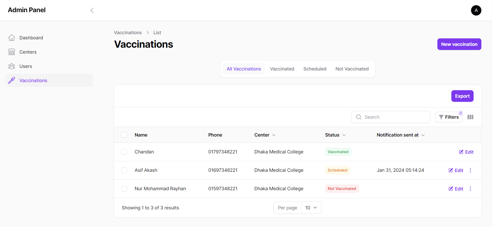

<h3 align="center">Vaccine Registration Application</h3>

#### Why?
This project was created to help people register for the vaccine.

#### Tech used

- [Laravel](https://laravel.com)
- [Livewire](https://laravel-livewire.com)
- [PHP](https://www.php.net)
- [Filament PHP](https://filamentphp.com)
- [MySQL](https://www.mysql.com)
- [Tailwind CSS](https://tailwindcss.com)

#### Setup Instructions
Follow the instructions

- Clone the repository
- Run `composer install`
- Run `npm install && npm run dev`
- Copy the `.env.example` file to `.env` and configure your database
- Run `php artisan key:generate` to generate the application key
- Run `php artisan migrate --seed` to create the database tables and seed the database
- Run `php artisan serve` to start the server and access the application

#### Run queue and task scheduling

- Run `php artisan schedule:run` to run the task scheduler 
- Run `php artisan queue:work` to run the queue

